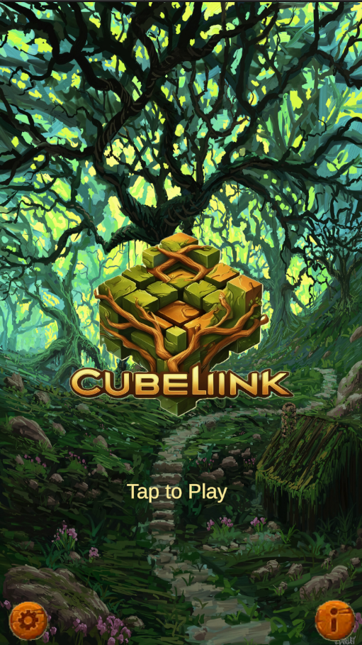
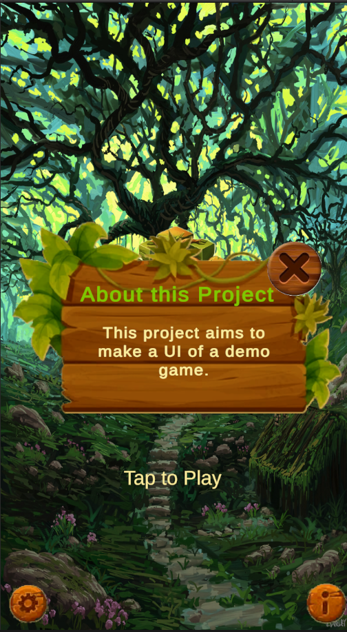
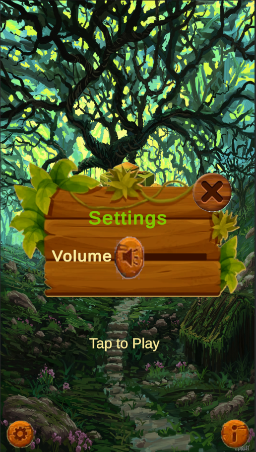
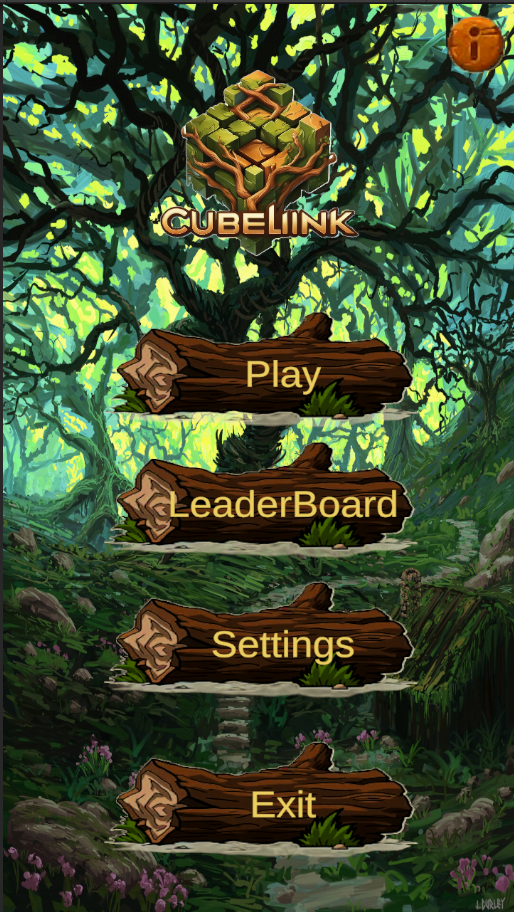
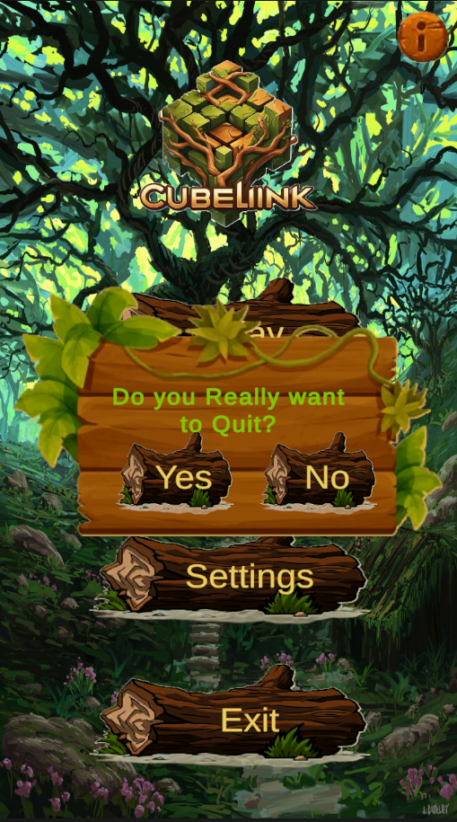

# 🌿 CubeLink - UI Demo Project

Welcome to **CubeLink**, a beautifully styled **UI demo project** created in Unity, showcasing responsive design, interactive menus, background audio, and elegant popup animations — all wrapped in a vibrant, fantasy forest theme.

---

## 🎮 Features

✨ **Main Functionalities**:
- **Opening Screen** with "Tap to Play" functionality
- **Main Menu** with:
  - **Play**
  - **Leaderboard**
  - **Settings**
  - **Exit** confirmation

🎧 **Audio**:
- Background music that loops continuously
- Volume slider to control in-game audio
- Mute/unmute toggle support

🧩 **UI & Interactions**:
- Smooth **button animations**
- Animated **popup windows** for Settings and About sections
- Custom-designed **icons and panels** with a forest aesthetic

📱 **Mobile Responsive**:
- Fully resolution-responsive layout for **multiple Android screen sizes**
- Canvas scaling configured for mobile devices (tested on phones & tablets)

---

## 🛠️ Technologies Used

- **Unity** (2022 or later recommended)
- **C#** for UI logic
- Unity’s **UI Toolkit / uGUI**
- Animator Controller for UI transitions
- Responsive design using **Canvas Scaler**

---

## 📸 Screenshots

### Start Scene

### Info Panel

### Settings Panel

### MainMenu Scene

### Exit Panel

